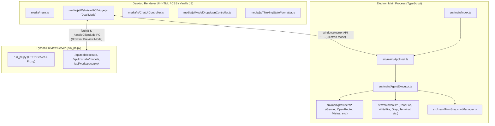

# KAI Agent - Desktop App Architectural Overview & System Design

This document details the architecture, component roles, and file-by-file specifications for the **KAI Agent Standalone Desktop Application** (`KAI Agent App/`).

---

## 1. Desktop App Runtime Architecture

### E. CSS Architecture & Strict Prohibition of `!important`
- **Zero `!important` Policy**: The use of `!important` is strictly prohibited across all stylesheets. Proper specificity, object-oriented CSS patterns, and clean cascading rules are required.
- **Single Source of Truth**: All shared tokens must reside in `:root` and theme overrides, with exact single base classes per UI component.

### F. Triple-File Documentation Synchronization Mandate
Whenever architecture, UI components, runtime features, or system design guidelines are modified, all 3 `AGENTS.md` and all 3 `overview.md` files must be updated simultaneously in lockstep:
1. Root workspace: `.agents/AGENTS.md` and `.agents/overview.md`
2. Desktop App: `KAI Agent App/.agents/AGENTS.md` and `KAI Agent App/docs/overview.md`
3. Extension: `Kai-Agent-extension/.agents/AGENTS.md` and `Kai-Agent-extension/docs/overview.md`

The Desktop Application supports a dual runtime environment:
1. **Production Mode (Electron Desktop EXE)**: Electron Main (`src/main/`) + Preload (`preload.ts`) + Renderer (`src/renderer/`).
2. **Local Preview Mode (Python CORS Proxy & Static Server)**: `python run_pc.py` serves `src/renderer/` and proxies local filesystem/tool requests.

---

## 2. Dedicated Desktop File Roles & Differences vs. Extension

| Desktop File Path | Primary Role in Desktop App | Differences & Architectural Boundary vs. Extension |
| :--- | :--- | :--- |
| **`src/renderer/media/js/WebviewIPCBridge.js`** | **Dual Electron & Browser Preview Bridge**. Dispatches to `window.electronAPI` in Electron mode, and runs `_handleClientSideIPC` + browser tool executors in Python preview mode. | **Dual Runtime Fallback**: Contains the browser-preview agentic loop, client-side SSE readers, and browser utility tools (`_toolCalculate`, `_toolUnitConverter`, `_toolGetTime`, etc.) for `run_pc.py`. In contrast, the Extension webview bridge is a lean ~150 line bridge without fallback code. |
| **`src/renderer/media/main.js`** | **Desktop UI Orchestrator**. Initializes the full desktop application layout, manages the Left Sidebar, folder selector, window controls, and chat session tabs. | **Sidebar Management**: Exclusively controls the Desktop Left Sidebar (`+ Nieuwe Chat`, chat history list, folder picker, settings). The Extension has no sidebar. |
| **`src/renderer/media/main.css`** | **Desktop Application Stylesheet**. Implements standalone dark/light design system tokens, collapsible sidebar layout, custom titlebar drag regions, and modal dialogs. | **Standalone Design Tokens**: Uses custom CSS root variables (`--bg-primary`, `--accent-primary`, etc.) instead of VS Code theme variables (`var(--vscode-*)`). |
| **`src/main/AppHost.ts` & `preload.ts`** | **Electron Main Backend & Secure Preload**. Manages Electron IPC listeners, window lifecycle, and exposes safe `window.electronAPI` via `contextBridge`. | **Electron Specific**: Implements native desktop window management and file dialogs. Replaces the Extension's `SidebarProvider.ts`. |
| **`src/main/AgentExecutor.ts`** | **Desktop Backend Agent Execution Engine**. Orchestrates multi-turn tool loops, snapshot creation, and streaming responses in Electron mode. | Parity with Extension Host backend, executed via Node.js in Electron Main. |
| **`src/main/providers/*`** | **Desktop LLM Provider Clients**. Dedicated TypeScript clients (`GeminiClient`, `OpenRouterClient`, `LMStudioClient`, `MistralClient`, `CohereClient`, `CerebrasClient`, `ZhipuClient`, `OmniRouteClient`). | Parity with Extension Host backend. |
| **`run_pc.py`** | **Static Server & CORS Proxy**. Serves `src/renderer/` static assets, exposes `/api/workspace/pick`, and proxies workspace tool requests to bypass browser CORS. | **Desktop Only**: Used strictly for rapid web browser previewing without launching Electron. Does not exist in Extension. |

---

## 3. Desktop UI Terminology & Layout Guidelines

1. **Left Sidebar (Desktop Exclusive)**:
   - Contains `+ Nieuwe Chat`, chronological chat history list, active workspace folder indicator, and footer settings.
   - When documentation or instructions mention the "sidebar", this ALWAYS refers to the Desktop App and NEVER to the Extension.
2. **Execution & Dev Commands**:
   - Run in Electron: `npm run dev` in `KAI Agent App`.
   - Run in Python preview: `python run_pc.py` in `KAI Agent App`.
   - Compile TypeScript: `npm run compile` in `KAI Agent App`.

3. **Theme Architecture & Light Mode**:
   - Integrated Theme Selector in General Settings (`SettingsController.js`): Dark, Light, and Auto/System (`prefers-color-scheme`).
   - Theme is immediately applied on startup (`main.js`) with zero FOUC flikkering.
   - 100% i18n parity across 18 languages in `AllLocales.js` and live Mermaid diagram theme re-rendering (`MermaidRenderer.js`).

4. **Instant Sidebar Chat Addition & JSON Title Generation**:
   - Chats appear in the Left Sidebar immediately upon sending a prompt with initial prompt fallback.
   - `BrowserCompletionEngine.js` generates concise conversation titles using a mandatory JSON output contract (`{"title": "..."}`) with a multi-stage parser that discards thinking traces (`<think>...</think>`) and preamble from small/reasoning models.
   - Response action buttons (copy, retry, edit, raw toggle, info) strictly reuse the universal `.icon-btn` component class with the hover outset/inset shadow (`box-shadow: var(--app-btn-inset)`).

5. **Staggered History Zoom-In & AI Stream Word Fade-In System**:
   - Chat history entries in the Left Sidebar enter with a smooth staggered zoom-in entrance (`@keyframes historyItemZoomIn` scaling from `0.92` to `1.0` and opacity `0` to `1`), timed dynamically with `--anim-delay: ${index * 50}ms`. In-place element diffing prevents re-render glitching when history syncs.
   - Streaming AI tokens in Desktop App & Extension dynamically wrap newly detected words in `` to fade into view smoothly (`@keyframes kaiWordFadeIn`) without flickering or restarting animation on already-rendered words. Markdown syntax, tags, and codeblocks are preserved intact, and HTML is cleanly finalized upon completion.

6. **Markdown Formatting & List Hierarchy Engine**:
   - The markdown italic parser strictly enforces CommonMark non-whitespace delimiter rules (`/(?:^|[\s\(\[\{])\*(?!\s)([^\*\r\n]+?)(?<!\s)\*(?=[\s\)\.\,\!\?\]\}]|$)/g`), preventing list bullet markers (`*   ...`) from ever triggering italic blocks.
   - Accurately parses top-level and indented nested sub-bullets (`    *`, `  -`) into hierarchical `<ul class="md-list">` and `<ul class="md-list md-sublist">` trees.

7. **Streaming Lookahead Delay Buffer & Syntax Settle Engine**:
   - `StreamBufferPipeline` queues incoming tokens in a timestamped FIFO buffer with a user-customizable lookahead delay (`--stream-settle-delay`).
   - Enforces a minimum base delay of 150ms with selectable increments (`None` -> 150ms, `100ms` -> 250ms default, `300ms` -> 450ms, `500ms` -> 650ms, `750ms` -> 900ms, `1s` -> 1150ms), allowing markdown markers to settle before DOM formatting.
   - Drains and commits all remaining tokens immediately on stream completion or tool start with zero latency.
   - Double-clicking any user chat bubble activates the inline prompt editor (`openInlineEditor`) to re-edit and resubmit prompts.

8. **LM Studio Performance Telemetry (Tokens Per Second)**:
   - Measures live token generation throughput for local LM Studio models and displays the metric (`Speed: XX.X tok/s`) in the assistant message Info popover.
   - Omitted for external cloud provider APIs to maintain clean metadata.

